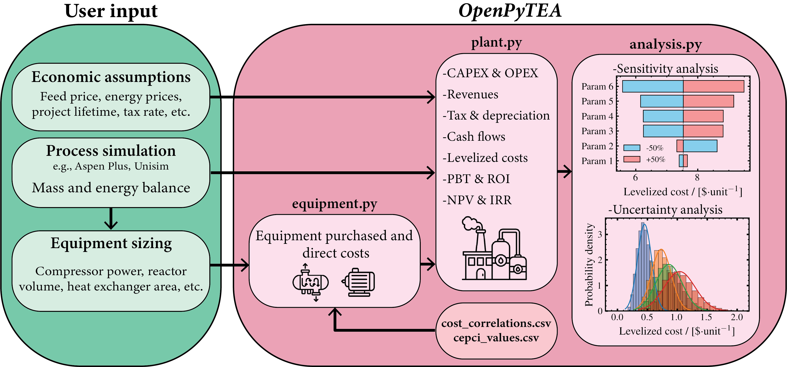

<p align="center">
  
</p>

**OpenPyTEA** is an open-source Python toolkit for performing **techno-economic assessment (TEA)** of chemical and energy systems. It was created to address a persistent gap in the TEA workflow: while process simulators model mass and energy balances, researchers often lack an equally transparent and flexible way to evaluate the **economic feasibility** of their designs. Commercial tools remain *black-box tools*, and many academic TEA implementations are process-specific, undocumented, or difficult to reproduce.

**OpenPyTEA** provides a fully open, modular, and traceable framework that brings TEA into the Python ecosystem. By integrating **equipment cost estimation**, **capital and operating expenditure modeling**, **cash-flow analysis**, **cost breakdowns**, **sensitivity evaluation**, and **Monte Carlo uncertainty propagation**, the toolkit enables users to perform end-to-end TEA with clarity and reproducibility.

Beyond its functionality, **OpenPyTEA is designed as a community-driven TEA platform**. Users can contribute new equipment cost correlations, improve economic models, report issues, and expand the toolkit’s capabilities over time. This collaborative approach helps build a shared, transparent, and continually improving TEA resource—similar to the open-source progress seen in the LCA community.

Whether used for early-stage process design, technology screening, or teaching, **OpenPyTEA** makes TEA more accessible, consistent, and aligned with FAIR research principles (Findable, Accessible, Interoperable, and Reusable).

**For a full walkthrough of the features and usage of OpenPyTEA, refer to the `walkthrough.ipynb` notebook**:  
https://github.com/pbtamarona/OpenPyTEA/blob/main/walkthrough.ipynb

**For some case-study examples, please check the `examples` folder:**
https://github.com/pbtamarona/OpenPyTEA/tree/main/examples

---

## ✨ Key Features
- **Modular architecture:** clean separation of cost correlations, equipment objects, plant economics, and uncertainty analysis.  
- **Transparent and reproducible:** all algorithms, equations, and assumptions are openly available for full traceability.
- **Cost breakdown visualization:** built-in functions to plot stacked bar charts of equipment costs, fixed capital, and operating costs.
- **Built-in uncertainty tools:** automatic generation of sensitivity plots and Monte Carlo simulations.
- **Workflow using JSON configuration files:** standardized input/output structure via `io.py` for reproducible analyses and multi-scenario evaluation.
- **Flexible analysis and visualization:** separation of data processing (`analysis.py`) and plotting (`plotting.py`) allows users to apply custom visualization tools.
- **Interoperable and extensible:** easy integration with process simulators, optimization frameworks, and LCA tools.  
- **Education-friendly:** ideal for teaching TEA and process design without reliance on proprietary software.  
- **Community-driven:** users can contribute new correlations, improve models, request features, and shape the evolution of the platform.  

---

## 📦 Installation

### 1. **Install from PyPI (recommended)**

```bash
pip install openpytea
```

### 2. **Install from GitHub (development version)**

```bash
pip install git+https://github.com/pbtamarona/OpenPyTEA
```

or with `uv`:

```bash
uv add git+https://github.com/pbtamarona/OpenPyTEA
```

**OpenPyTEA** requires **Python ≥ 3.9**.  
The main dependencies include:

- `matplotlib`
- `numpy`  
- `pandas`
- `scienceplots`  
- `scipy`    
- `tqdm`  
- `jinja2` 

---

## ⚙️ Package (Repository) Structure
```
src/openpytea/
├── equipment.py            # Equipment-level costing and inflation correction
├── plant.py                # Plant-level TEA: CAPEX, OPEX, cash flows, financial metrics
├── analysis.py             # Sensitivity and uncertainty analysis (sensitivity plots, Monte Carlo)
├── plotting.py             # Visualization functions (plots and figures)
├── io.py                   # JSON-based workflow: load inputs and export results
├── helpers.py              # Helper functions for data handling and common operations
└── data/                   # Cost correlations database and CEPCI data
examples/                   # Example notebooks and case studies
walkthrough.ipynb           # Walkthrough of the package

backend/                    # FastAPI backend for the web GUI
├── app/
│   ├── main.py             # FastAPI app with CORS and router mounting
│   ├── state.py            # In-memory session state
│   ├── schemas.py          # Pydantic request/response models
│   ├── util.py             # JSON serialization utilities
│   ├── routers/            # API endpoints (equipment, plant, analysis, I/O)
│   └── presets/            # Example preset JSON files
└── requirements.txt

frontend/                   # React + TypeScript web GUI
├── src/
│   ├── api/client.ts       # Typed API client
│   ├── types/index.ts      # TypeScript interfaces
│   ├── pages/              # Equipment, Plant Config, Results, Analysis, Monte Carlo, Compare
│   ├── App.tsx             # Tab navigation + examples dropdown
│   └── App.css             # Styling
└── package.json

pyproject.toml
README.md
```
---

## 🏗️ Software Architecture



Software architecture and data flow of **OpenPyTEA**, illustrating the progression from user input to TEA output. Users provide economic assumptions, process simulation results, and equipment-sizing parameters. Equipment-sizing information is linked with cost correlations and CEPCI values stored in CSV databases to calculate inflation-adjusted purchased and direct costs. `Equipment` objects are aggregated into a `Plant` object, where CAPEX, OPEX, and financial performance metrics are evaluated. The `analysis.py` module subsequently operates on `Plant` objects to perform sensitivity and uncertainty analyses.

---

## 🖥️ Web GUI (**work in progress**)

OpenPyTEA includes an optional web-based graphical interface for users who prefer a visual workflow over Python scripting. The GUI provides the full TEA workflow through a tabbed browser interface:

- **Equipment** — add, edit, and remove equipment with cost database lookup
- **Plant Config** — configure location, financial parameters, labor, products, and variable OPEX
- **Results** — run calculations and view metric cards, cost breakdown charts, and cash flow tables
- **Analysis** — sensitivity plots and tornado diagrams. Sensitivity supports a **multi-panel grid** (different parameter and metric per panel, e.g. NPV vs. interest rate, ROI vs. electricity price, all in one figure) and **multi-plant overlay** (curves for every plant added on the Compare tab share the same axes for direct comparison)
- **Monte Carlo** — uncertainty analysis with histogram distributions, fitted normal curves, and summary statistics. **Multi-plant overlay** shows distributions for several plants on the same axes, mirroring `plot_multiple_monte_carlo` from the library
- **Compare** — side-by-side comparison of saved plants (CAPEX/OPEX breakdown bars, key metric bars). Plants imported here are also reused as the overlay set on the Analysis and Monte Carlo tabs
- **Downloadable charts** — all plots include a download button to export as standalone PNG images with full axis labels
- **Examples** — built-in presets from the case study notebooks for quick demonstration

### Running the GUI

**Quick start** (requires Python 3.10+ and Node.js — macOS/Linux):

```bash
./start.sh
```

That's it. On first run the script creates a local `.venv`, installs the backend dependencies, runs `npm install`, then launches both servers and opens your browser at http://localhost:5173. Subsequent runs just start the servers. Press `Ctrl+C` to stop both.

<details>
<summary><strong>Manual steps</strong> (if you'd rather run backend and frontend yourself)</summary>

**Backend** (Python 3.10+):
```bash
pip install -e .          # install OpenPyTEA from repo root
cd backend
pip install -r requirements.txt
PYTHONPATH=../src python3 -m uvicorn app.main:app --reload --port 8000
```

**Frontend** (Node.js):
```bash
cd frontend
npm install
npm run dev
```

Then open http://localhost:5173.

</details>

Click **Examples** in the header to load a case study preset and explore.

For detailed architecture documentation, see `GUI_ARCHITECTURE.md`.

---

## 🧠 Core Concepts

### 1. **Equipment-level costing**

Each process unit (e.g., compressor, heat exchanger, reactor) is represented by an `Equipment` object:

```python
from openpytea.equipment import Equipment

compressor = Equipment(
    name='COMP',
    param=5000,  # kW
    category='Compressors, fans, & Blowers',
    type='Compressor, centrifugal',
    material='Carbon steel'
)

print(compressor.direct_cost)
```

Each equipment item retrieves its cost correlation from the internal database in `data/cost_correlations.csv` and adjusts the cost to the desired year using the Chemical Engineering Plant Cost Index (CEPCI).

### 2. **Plant-level techno-economic assessment**

Multiple equipment objects can be grouped into a `Plant` instance for full TEA

```python
from openpytea.plant import Plant

ammonia_plant = Plant({
    'name':'Ammonia Production Plant', 
    'country':'Netherlands',
    'process_type':'Fluids', 
    'equipment'=[compressor],
    'interest_rate':0.09, 
    'plant_utilization':0.95, 
    'project_lifetime':20,  # in years
    'plant_products': {  # Here we define the product(s) of the plant
        'ammonia': {
            'production':125_000, # Daily production in kg/day,
        }
    },
    'variable_opex_inputs':{
        'electricity':{
            'consumption': 110,  # Daily consumption, in MWh 
            'price': 75  # US$/MWh
        },
        'hydrogen':{
            'consumption': 22_000,  # Daily consumption, in kg/day
            'price': 2  # US$/kg
        },
    },
})

plant.calculate_cash_flow(print_results=True)
plant.calculate_levelized_cost()
```
Main outputs include:
- Capital expenditures (CAPEX): inside/outside battery limits, engineering, contingency, and location factors
- Operating expenditures (OPEX): variable and operating expenditures, including utilities, maintenance, labor, and overhead costs
- Financial metrics: Net Present Value (NPV), Internal Rate of Return (IRR), Return on Investment (ROI), Payback Time (PBT), and Levelized Cost of Product (LCOP)

### 3. **CAPEX and OPEX breakdown plots**

OpenPyTEA includes convenience functions for visualizing the economic structure of a process plant using stacked bar plots:

- `plot_direct_costs_bar(plant)`: direct equipment costs (per equipment item).  
- `plot_fixed_capital_bar(plant)`: fixed capital components (ISBL, OSBL, design & engineering, contingency).  
- `plot_variable_opex_bar(plant)`: variable operating costs by input mass and energy stream.  
- `plot_fixed_opex_bar(plant)`: fixed operating expenses, including labor, supervision, maintenance, overhead, R&D, and more.

These plots provide a quick visual breakdown of the main CAPEX and OPEX contributors in a flowsheet.

### 4. **Sensitivity and uncertainty analysis**

**OpenPyTEA** provides integrated tools for visual sensitivity and probabilistic analysis of cost and performance drivers.

One-Way Sensitivity Line Plot
```python
from openpytea.analysis import sensitivity_plot

results = sensitivity_plot(
    plant, 
    parameter="electricity", 
    plus_minus_value =0.5
    )
```
The `plant` input may also be a list of `Plant` objects to generate comparison plots.

Tornado Plot (One-at-a-Time Sensitivity)
```python
from openpytea.analysis import tornado_plot

tornado_plot(
    plant,
    plus_minus_value = 0.5,
)
```

Monte Carlo Simulation
```python
from openpytea.analysis import monte_carlo

results = monte_carlo(
    plant,
    num_samples=1_000_000
)

```
Outputs include probability distributions and confidence intervals for LCOP or NPV—supporting uncertainty-informed decision-making. With `plot_multiple_monte_carlo`, **OpenPyTEA** can also visualize Monte Carlo results for multiple plants to enable uncertainty comparisons.

---
### 5. **Workflow using JSON configuration files**

**OpenPyTEA** supports a workflow using structured JSON input files via the `io.py` module. This enables standardized, reproducible, and scalable TEA studies.

Key functionalities include:
- `run_equipment()`: evaluate equipment costs from JSON input
- `run_plant()`: construct and evaluate a plant configuration
- `run_tea()`: execute full TEA, including cost breakdowns, sensitivity, and uncertainty analysis

This workflow is demonstrated in `case_study_1_with_JSON.ipynb` in the example folder.

## ▶️ Tutorials

Step-by-step tutorial videos covering the full OpenPyTEA workflow are available here:

**Tutorial 01 - Creating Equipment**

<a href="https://www.youtube.com/watch?v=z-hspQh_wVE" target="_blank">
  
</a>

**Tutorial 02 - Creating a Plant**

<a href="https://www.youtube.com/watch?v=eoooa2gjCwE" target="_blank">
  
</a>

**Tutorial 03 - Performing Analysis**

<a href="https://www.youtube.com/watch?v=o1zosMUZaDc" target="_blank">
  
</a>

The notebooks used in the tutorials and the raw video files are available in the [tutorial_videos folder](https://github.com/pbtamarona/OpenPyTEA/tree/main/tutorial_videos)

## 📘 Example Workflows

Example notebooks are available in the `examples/` folder, including:

- Comparison of hydrogen production pathwways 
- Hydrogen liquefaction precooling system
- Geothermal-based heating and power generation

Run any example via:
```bash
jupyter notebook examples/hydrogen_liquefaction.ipynb
```
Each notebook demonstrates:
- Input definition and equipment configuration
- Cash-flow and investment evaluation
- Sensitivity and uncertainty analysis
- Visualization of key economic indicators

## 🧑‍🏫 Educational Use

**OpenPyTEA** is suitable for chemical and process engineering education.
Students can perform full TEA using their simulation outputs—estimating capital, operating, and profitability metrics—without commercial software.
All algorithms are visible and modifiable, eliminating the “black-box” nature of most TEA tools.

## 🛠️ Contributing
We welcome community contributions!
You can help by:
- Adding or updating equipment cost correlations
- Improving the documentation or creating tutorials
- Extending the visualization or uncertainty modules

To contribute:
1. Fork the repository.
2. Create a new branch:
```bash
git checkout -b feature-new-equipment
```
3. Commit your changes and open a Pull Request.

Please follow PEP8 coding conventions and include a short description of your updates.

---

## 📚 Citation

If you use **OpenPyTEA** in your research, please cite it using the automatic GitHub citation feature or the `CITATION.cff` file included in this repository.

On GitHub, click:
```
Repository page → "Cite this repository"
```
This will provide formatted citation export options (BibTeX, APA, MLA, etc.) based on the CITATION.cff metadata.

Or if you prefer to cite manually, you may use:

> Tamarona, P.B., Vlugt, T.J.H., & Ramdin, M. (2025). *OpenPyTEA: An open-source python toolkit for techno-economic assessment of process plants with economic sensitivity and uncertainty evaluation.* GitHub Repository. Available at: [https://github.com/pbtamarona/OpenPyTEA](https://github.com/pbtamarona/OpenPyTEA)

**BibTeX:**
```bibtex
@misc{tamarona2025openpytea,
  author       = {Panji B. Tamarona and Thijs J.H. Vlugt and Mahinder Ramdin},
  title        = {OpenPyTEA: An open-source python toolkit for techno-economic assessment of process plants with economic sensitivity and uncertainty evaluation},
  year         = {2025},
  url          = {\url{https://github.com/pbtamarona/OpenPyTEA}},
  version      = {2.0.0},
  note         = {Accessed: YYYY-MM-DD}
}
```

---

## 📄 License

**OpenPyTEA** is released under the MIT License.

You are free to use, modify, and distribute the code with proper attribution.

## 📬 Contact
Panji B. Tamarona

📧 P.B.Tamarona@tudelft.nl

Repository: https://github.com/pbtamarona/OpenPyTEA